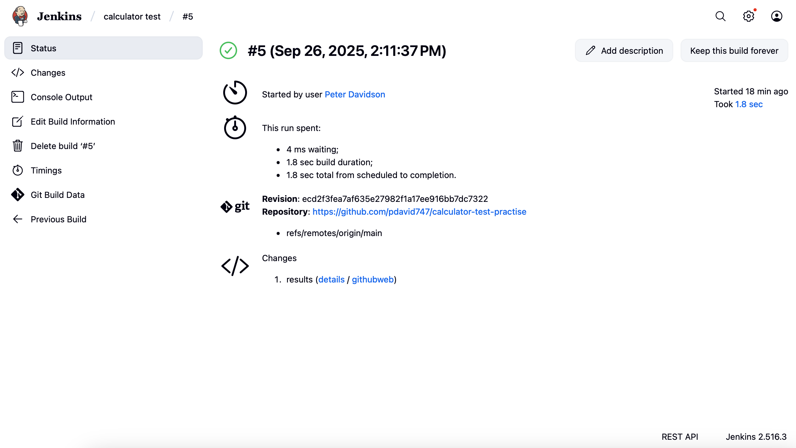

# Calculator Project

## Overview
This project implements a **simple calculator** in Python, supporting basic arithmetic operations and square root calculations. It also includes a **test suite** using **pytest** to verify that each operation works correctly. This project is ideal for practicing **unit testing**, **automation testing**, and integration into **CI/CD pipelines** like Jenkins.

---

## Files
- **calculator.py** – contains the implementation of calculator functions.  
- **test_.py** – contains test cases for each calculator function using pytest.

---

## Calculator Functions

### 1. `add(a, b)`
- **Purpose:** Returns the sum of two numbers.  
- **Input:** Two numbers (`a` and `b`).  
- **Output:** Sum of `a` and `b`.  
- **Example:**  
```python
add(2, 3)  # returns 5
add(-1, 1) # returns 0
```

### 2. `subtract(a, b)`
- **Purpose:** Returns the difference between two numbers.  
- **Input:** Two numbers (`a` and `b`).  
- **Output:** Result of `a - b`.  
- **Example:**  
```python
subtract(5, 3)  # returns 2
```

### 3. `multiply(a, b)`
- **Purpose:** Returns the product of two numbers.  
- **Input:** Two numbers (`a` and `b`).  
- **Output:** Product of `a` and `b`.  
- **Example:**  
```python
multiply(3, 4)  # returns 12
multiply(-2, 5) # returns -10
```

### 4. `divide(a, b)`
- **Purpose:** Returns the result of dividing `a` by `b`.  
- **Input:** Two numbers (`a` and `b`).  
- **Output:** Result of `a / b`.  
- **Edge Case:** Raises a `ValueError` if `b` is 0.  
- **Example:**  
```python
divide(10, 2)  # returns 5
divide(5, 2)   # returns 2.5
divide(10, 0)  # raises ValueError: Cannot divide by zero
```

### 5. `sqrt(a)`
- **Purpose:** Returns the square root of a number.  
- **Input:** A number `a`.  
- **Output:** Square root of `a`.  
- **Example:**  
```python
sqrt(4)   # returns 2
sqrt(16)  # returns 4
```

# Calculator Project Testing

The project uses `pytest` to ensure that all calculator functions work correctly. Each function has a corresponding test in `test_calculator.py`.

## Test Functions

- **`test_add()`** – Checks addition for positive and negative numbers.  
- **`test_subtract()`** – Checks subtraction, including negative results.  
- **`test_multiply()`** – Checks multiplication with positive and negative numbers.  
- **`test_divide()`** – Checks division for normal cases and ensures division by zero raises an error.  
- **`test_sqrt()`** – Checks square root calculation.  

## How to Run Locally

1. **Install dependencies**  
   ```bash
   pip install pytest
   ```

2. **Run tests**
   ```bash
   pytest test.py
   ```
Pytest will execute all test functions and display results.
Passing tests indicate the calculator functions are working correctly.

## Running in Jenkins

You can automate testing of this calculator project using Jenkins.

### 1. Prerequisites

- Jenkins installed  
- Python 3 installed and accessible in Jenkins’ PATH  
- Git installed and project pushed to a GitHub repository  
- `pytest` installed in the environment Jenkins will use  

### 2. Create a Jenkins Job

1. Open Jenkins → **New Item** → Enter a job name → **Freestyle Project** → OK  
2. In **Source Code Management**, select Git and enter your repository URL  
3. Specify the branch to build (e.g., `main`)

### 3. Add Build Steps

In the **Build** section → **Execute shell**, add the following:

```bash
# Navigate to workspace folder
cd "$WORKSPACE"

# Create a virtual environment
python3 -m venv venv

# Activate the environment
source venv/bin/activate

# Install pytest
pip install pytest

# Run tests and generate JUnit XML report
pytest test_calculator.py --junitxml=results.xml
```

> Tip: Ensure there are no spaces in the workspace folder path, or wrap paths in quotes.  

### 4. Optional: Publish Test Results

1. Go to **Post-build Actions** → **Publish JUnit test result report**  
2. Enter `results.xml` as the test report path  

Jenkins will display test results after each build.  

### 5. Build the Job

Click **Build Now**.  
Jenkins will fetch the code, set up the environment, run tests, and display results.  

### Purpose

- Demonstrates basic Python programming with functions  
- Provides practice with unit testing and exception handling  
- Can be integrated into CI/CD pipelines like Jenkins for automated testing  
- Prepares for future projects that require automated testing and continuous integration




